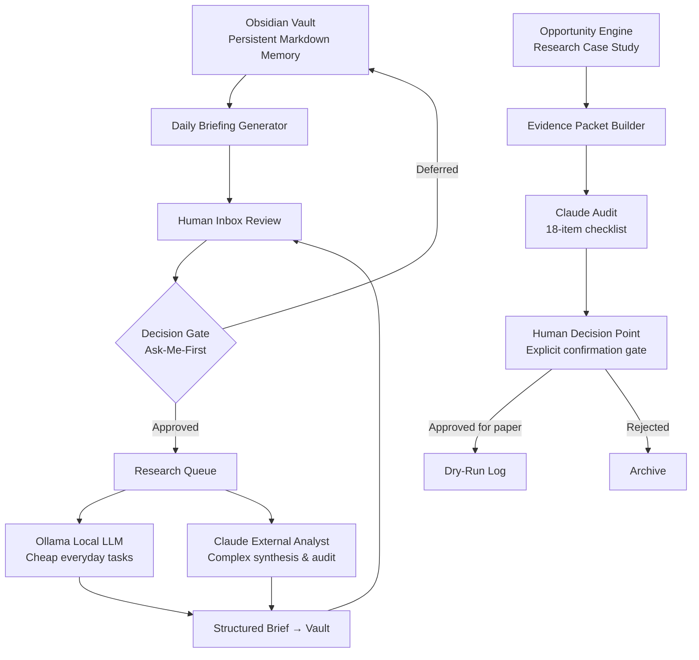

# Serah — Local-First Personal AI Assistant

> A personal AI system built for planning, research, memory, and accountability — with a human-controlled, safety-gated research pipeline as a case study in responsible AI design.

[](https://github.com/Alex224225/serah-local-assistant/actions/workflows/ci.yml)

---

## What Is Serah?

Serah is a local-first personal AI assistant. She lives on a dedicated machine, uses a local [Obsidian](https://obsidian.md/) vault as persistent memory, and treats external LLMs (Claude, Ollama) as outside consultants rather than her own brain.

She is built around one core principle: **the human stays in control of every consequential action.**

Serah is not a chatbot and not an autonomous agent. She is a local research, memory, and accountability system that amplifies human decision-making without replacing it.

---

## Architecture Overview



*The Opportunity Engine (bottom row) is a separate research-only case study built on Serah's infrastructure. See [docs/trading-safety-harness-case-study.md](docs/trading-safety-harness-case-study.md).*

---

## Core Design Principles

**Local-First Memory.** Serah's memory lives in an Obsidian vault — plain Markdown files on a dedicated local machine. Memory persists across AI model changes, has no conversation context limits, and is human-readable and auditable at any time.

**Outside Consultant Model.** Claude and other LLMs are called in for complex analysis, auditing, and synthesis. They are not Serah's brain. When a session ends, the vault retains everything important. This prevents treating a stateless LLM session as a persistent agent.

**Ask-Me-First Gates.** Serah operates freely for low-risk local work. She must ask before any action in sensitive categories including: spending money or using paid APIs, trading financial instruments, deleting important files, installing major software, changing system or security settings, exposing local services online, sending emails or messages, connecting to bank or broker accounts, and rewriting major project files. These gates are behavioral controls enforced through prompt design and session structure — they are not complete technical security boundaries. Code-level isolation, process permissions, and tool restrictions in the private system provide additional layers.

**Cheap-First Inference.** A local Ollama model handles everyday cheap tasks: inbox processing, briefing generation, idea classification, health checks. Claude is called only when the task requires it.

---

## Feature Status

| Feature | Status |
|---|---|
| Obsidian vault structure and naming conventions | Implemented in private system |
| Ask-Me-First gate enforcement (prompt design) | Implemented in private system |
| Local Ollama model for cheap inference | Implemented in private system |
| Daily briefing generation | Implemented in private system |
| Inbox review loop | Implemented in private system |
| Idea proposal cycle | Implemented in private system |
| Research queue and brief format | Implemented in private system |
| Context pack / handoff system | Implemented in private system |
| Opportunity Engine safety harness | Implemented in private system; documented here |
| Public demo package (`serah_demo`) | Demonstrated in this repository |
| Voice interface integration | Planned |
| Browser-controlled research automation | Planned |
| Local dashboard | Planned |

---

## This Repository

This is the **public portfolio version** of the Serah project. It contains:

- Documentation and architecture notes from the private system
- A fully runnable public demo package (`src/serah_demo/`) demonstrating the evidence-packet pipeline with synthetic data
- Synthetic fixture examples under `examples/`
- A CI workflow that runs safe tests with no secrets and no network access

**What is not here:** The private production system — including the scanner, the full Obsidian vault, brokerage configuration, agent prompt templates, operational logs, and personal data — remains private. Source code for production components is available on request with context.

## Repository Layout

```
serah-local-assistant/
├── README.md # This file
├── CHANGELOG.md
├── CONTRIBUTING.md
├── LICENSE # MIT
├── ROADMAP.md
├── SECURITY.md
├── pyproject.toml
├── docs/
│ ├── serah-architecture.md # How Serah works as a local assistant
│ ├── trading-safety-harness-case-study.md
│ ├── opportunity-engine-overview.md
│ └── proof-log.md
├── assets/
│ └── README.md # Placeholder for diagrams
├── examples/
│ ├── README.md # Explains synthetic nature of all fixtures
│ ├── synthetic_alert.json # Example scanner alert (synthetic)
│ ├── invalid_alert.json # Example rejected input
│ ├── valid_packet.json # Example full evidence packet (synthetic)
│ ├── review_packet.md # Human-readable audit presentation
│ └── operator_report.txt # Example operator session summary
├── src/
│ └── serah_demo/
│     ├── __init__.py
│     ├── main.py # CLI entry point
│     ├── models.py # Data models
│     ├── validator.py # Field and logic validation
│     ├── packet_builder.py # Evidence packet construction
│     ├── report_builder.py # Human-readable report generation
│     └── demo.py # End-to-end demonstration
└── tests/
    └── test_demo.py # Test suite for the public demo
```

---

## Running the Public Demo

The demo works entirely with synthetic local data. It has no network access, no brokerage connection, and no capability to place, draft, or submit any financial order.

```bash
# Install the package (Python 3.11+ recommended)
pip install -e ".[dev]"

# Run the end-to-end demonstration
python -m serah_demo

# Run tests
pytest
```

The demo:

1. Loads a synthetic alert for a fictional entity (`SYNT-X`)
2. Validates required fields and data types
3. Rejects malformed or internally inconsistent inputs
4. Builds a structured evidence packet with provenance, timestamps, and a content hash
5. Generates a human-readable review report
6. Prints a safe operator summary

All fixture data uses obviously fictional symbols. No output from this demo constitutes or resembles a real financial recommendation.

---

## The Opportunity Engine — Research Case Study

The Opportunity Engine is a **research-only safety-engineering case study** built on Serah's infrastructure. It demonstrates how an LLM-assisted research pipeline can enforce hard gates between a market observation and a human decision point.

It is not a trading bot. The human is the only entity in the system that can act on any finding, and only after the system has produced and audited a structured evidence packet.

**Orders placed to date: 0. Current dry-run counter: 0/10 on both engines (live eligibility blocked).**

See [docs/trading-safety-harness-case-study.md](docs/trading-safety-harness-case-study.md) for the full case study.

---

## Current Limitations

- All production components run in a private system not accessible from this repository.
- The public demo uses synthetic data only; it cannot connect to real market data sources.
- The Ask-Me-First gate system relies on prompt design and session structure; it is a behavioral control, not a code-enforced hard boundary.
- The explicit human-confirmation gate (typed phrase) is a session-level approval mechanism — it is not a cryptographic or process-isolated lock.
- No backtesting, simulated profit/loss figures, or performance claims exist or are made.
- Ollama model selection and vault structure are documented but not runnable from this repository.

---

## Roadmap

See [ROADMAP.md](ROADMAP.md) for the full roadmap.

Near-term priorities:

- Complete public demo package and CI pipeline
- Add architecture diagrams to `assets/`
- Expand synthetic fixture coverage
- Document the context-handoff and briefing systems in more detail

---

## Security

See [SECURITY.md](SECURITY.md) for the security policy and responsible disclosure process.

---

## Contributing

See [CONTRIBUTING.md](CONTRIBUTING.md).

---

## License

MIT — see [LICENSE](LICENSE).
